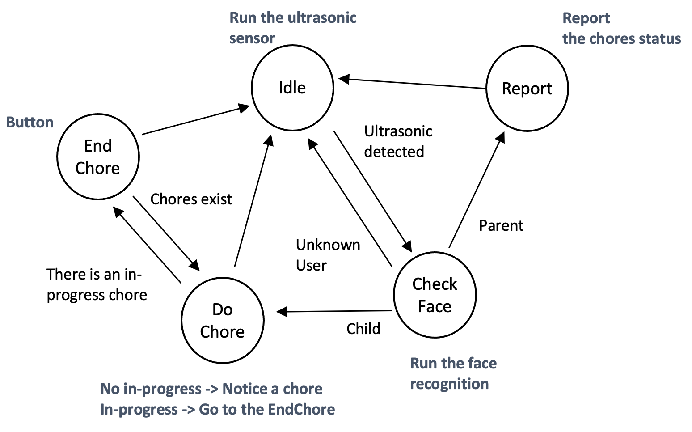

# ChoreBuddy
## Statemachine



## Setup

The code uses `black` for python code formatting, and `eslint` and `prettier` for `yml` and others. The application also uses `tiny-db`, `python-dotenv`, `pyyaml`, and `gTTS`. So, install the packages before using the application.

```bash
pip3 install python-dotenv tinydb pyyaml gTTS
```

TTS needs MP3 player. You can use `VLC`, the default video player of Raspberry Pi. If your Pi does not have `VLC`, then you can try `ffplay`. Please install `ffmpeg` for `ffplay`.

```bash
# install ffmpeg
$ sudo apt update
$ sudo apt install -y ffmpeg
```

### Environment

The application reads its configuration from `.env`. Create `.env` at the directory where `main.py` exists.

- `DB_FILE`: The database file path
- `DATA_FILE`: The yml path. The yml has users and chores data
- `TTS_PLAYER` Determine which MP3 player to use for TTS
- `ULTRASONIC_TRIG_PIN`: Trigger GPIO pin of Ultrasonic sensor
- `ULTRASONIC_ECHO_PIN`: Echo GPIO pin of Ultrasonic sensor
- `BUTTON_YES_PIN`: Yes button GPIO pin
- `BUTTON_NO_PIN`: No button GPIO pin
- `MODEL_FILE`: Face recognition model file path
- `ROTATE_CAM`: Rotate a camera or not
- `CV2_WINDOW`: Show CV2 camera window or not

```
# database and chore list
DB_FILE=data.json
DATA_FILE=list.yml

# text to speech player; VLC or FFPLAY
TTS_PLAYER=FFPLAY

# ultrasonic sensor pins
ULTRASONIC_TRIG_PIN=5
ULTRASONIC_ECHO_PIN=6

# tactile button pins
BUTTON_YES_PIN=16
BUTTON_NO_PIN=20

# face recognition
MODEL_FILE="./utils/encodings.pickle"
ROTATE_CAM=FALSE
CV2_WINDOW=TRUE
```

### Yaml

The application updates data at the beginning. The application deletes a tiny-db database file, reads `list.yml`, and inserts users and chores into the database when you start the application every time.

```yml
user:
  child:
    - John
    - Hayun
  parent:
    - Sung
    - Young
chore:
  - name: John
    task:
      - Do A
      - Do B
      - Do C
  - name: Hayun
    task:
      - Do D
      - Do E
```
